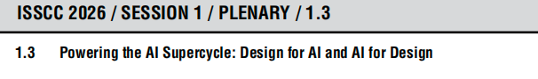
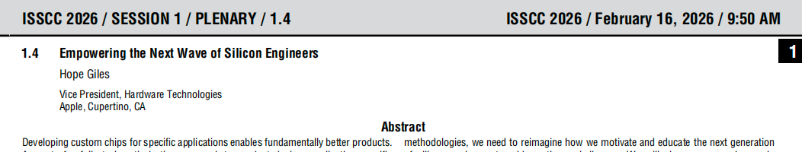
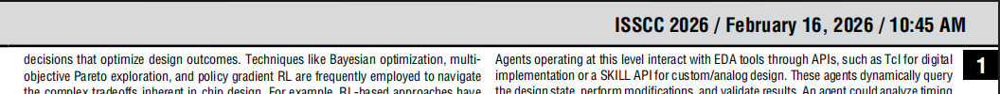
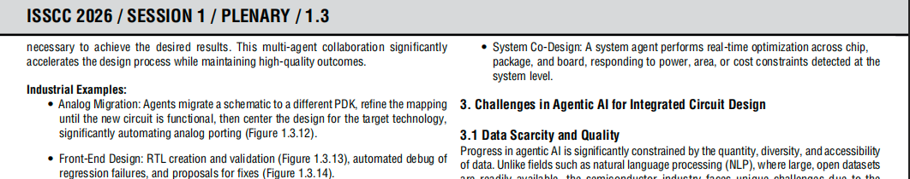
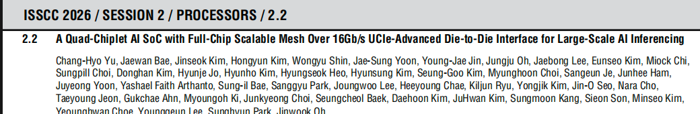
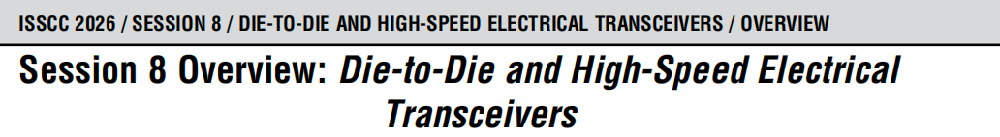
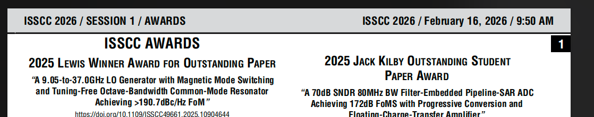

## 修改意见 001
0. 目前前端界面部分还可以，暂时不用修改。主要的问题还是在拆分规则的识别上。
1. 不要依赖目录按照规则匹配去发现章节的起始和结束页
2. 不要依赖文章里写的页码编号，以实际解析过程中在文件中数出来的页号为准
3. 这个文档我想要的拆分结果和规则如下：
    a.这个文档有37个大的主题，每个大主题下面有若干个子主题每个子主题都是一篇独立的论文，我希望拆分出每个子主题的论文，即拆分到1.1.. 1.2. 这种粒度
    b.通过我对这个文档的观察，你应该只需要看页眉就能识别出他们，页眉中第一次出现一个新的x.x章节就是一个子主题的开始页，例如子主题1.1的页眉为“ISSCC 2026 / SESSION 1 / PLENARY / 1.1”，一个子主题内的页眉看起来只会是这个子主题的固定页眉或者是一个演讲时间如“ISSCC 2026 / February 16, 2026 / 10:45 AM”，如果出现其他值应该就是下一个子主题或者是一些会议流程上的介绍了，你可以通过这个规律找到每个子主题的起始和结束页
    c.流程无关页就不用输出了
    d.每个子主题拆分出的文件名以其编号和文章名命名，就是这个子主题起始页的第一行的内容
4. 做好你代码的可扩展性，将上面的规则识别部分和识别好后按照页码拆分输出文件部分做好功能隔离，以便后续用其他的规则函数拆分别的文档

### 提示 002
0. 文档一开始的一些页都是无效的不用管
1. 直到开始看到页眉是一个子主题格式了开始这个子主题的抓取，

识别到子主题开始后，开始连续抓取
ps 好像这页页眉既有主题编号也有时间，这种也算是这个新子主题的内容

2. 这是一个子主题文章中的某一页，他的页眉是时间日期，继续抓取

3. 然后这还是这个子主题中的某页，页眉又变成了这个子主题的章节，继续抓取

4. 然后这个子主题的连续多页就都是只有这两种页眉
5. 直到出现下一个子主题编号出现，则上一个子主题结束抓取，开始新的子主题抓取

6. 像下面这些就都是无关页了，遇到无关页也算一个章节结束，然后继续向下查找直到一个新的子主题或者文档结束

等等各种各样的页眉或者空页眉

